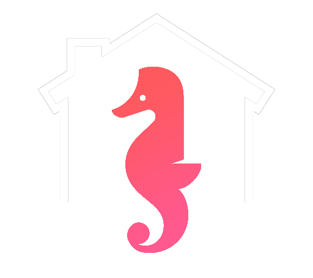
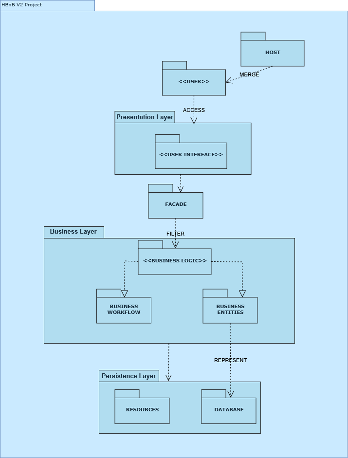
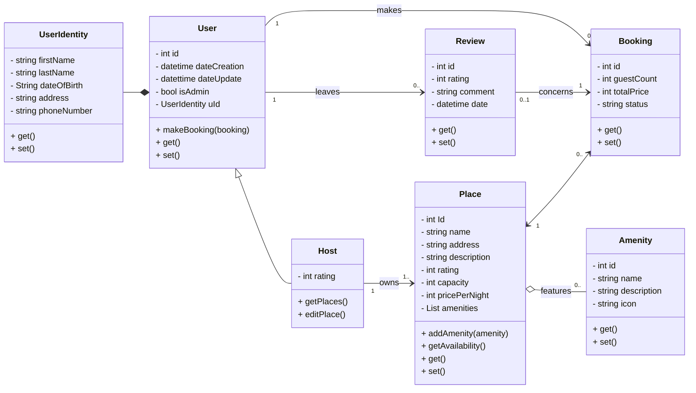
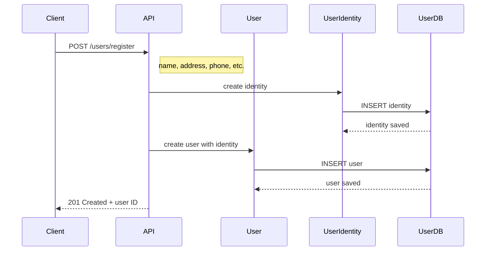
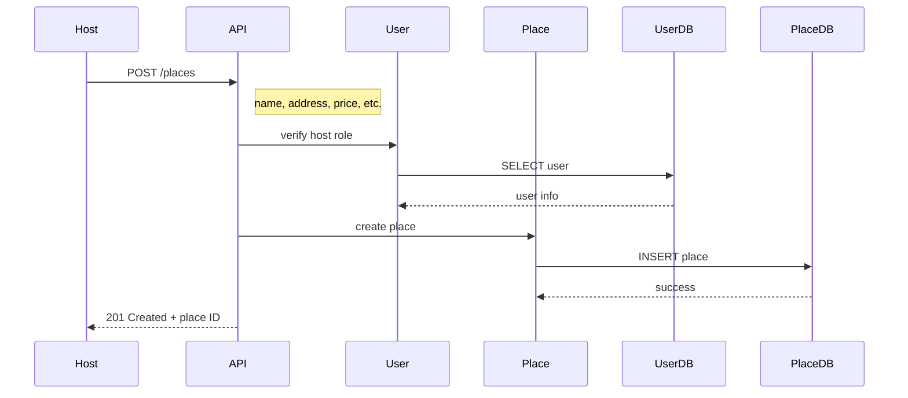
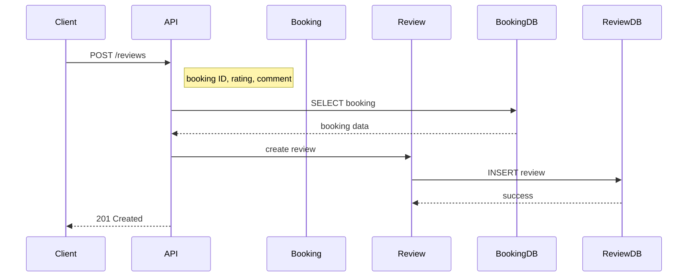
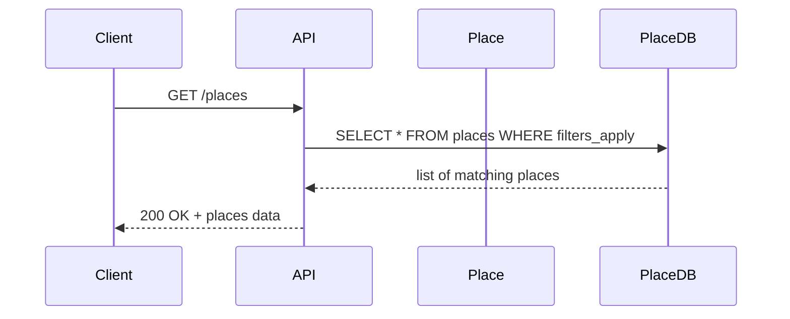

# Holberton - HBnB Project - Part 1 - Project Documention

<p align="center">
  
</p>

## :checkered_flag: Introduction

Welcome to the documentation for our **HBnB Project**. This document provides a comprehensive overview of the project's scope.

---

### :open_file_folder: High-Level Package Diagram

The system follows a layered architecture, ensuring separation of concerns and maintainability. Below is a high-level package diagram illustrating said structure:



#### The package diagram features the following:

### :bricks: A Layered Architecture

- **Presentation Layer**: Handles user interactions through user interface and API calls.
- **Business Logic Layer**: Contains an abstraction of the business rules and logic.
- **Data Access Layer**: Manages persistence and data operations.

### :performing_arts: A Facade Pattern

- **Facade** is a structural design pattern that provides a simplified interface to a library, a framework, or any other complex set of classes.

---

## 🧠 Business Logic Layer

### 🧬 Class Diagram

The core business logic is abstracted through classes and objects as is the aim of object-oriented principles. The class diagram below illustrates the main entities and their relationships:



### :mag: Entities Overview

---

- **User and UserIdentity**: Is used to describe an user of the service with attributes fitting its role. It is the entity around which the service revolves.
- **Host**: Herited from the User class, his particularity is to offer a service in the form of one or more places to rent.
- **Place**: It is the service provided by hosts. A host must owns at least one place, but can also own several.
- **Review**: This entity translates the quality of the service as experienced by the user.
- **Booking**: Is used to keep track of the availability of places as well as the number of guests, the duration of the stay or the price total of the service provided.
- **Amenity**: This entity is a surplus service provided by the host. It is not mandatory, but it greatly appreciates the value of a place.

These components work together to provide a well defined abstraction of the business workings.

### :scroll: Translating Classes relationship to code

---

Relations between entities are not mere cosmetic, they serve to describe reality and, as such, help build a reliable code that translates to a real-life service.

The most important relations featured in this class diagram are *** Composition *** and *** Aggregation ***.

What follows are code snippets that aim to illustrate how composition and aggregation work in Python:

Here, Amenity is aggregated to Place; Amenity is used as an attribute of the class Place, but is not mandatory for it to work.
```python
class Amenity:
    def __init__(self, id : int, name : str, description : str):
        self.__id = id
        self.__name = name
        self.__description = description

    def __str__(self):
        return self.__name

class Place:
    def __init__(self, id : int, name : str, address : str, description : str):
        self.__id = id
        self.__name = name
        self.__address = address
        self.__description = description
        self.__amenities =  []

    def __str__(self):
        strList = ', '.join(str(amenity) for amenity in self.__amenities)
        format = "Nom du lieu: {}\n" \
        "Adresse: {}\n" \
        "Description: {}\n" \
        "Commodités: {}\n".format(self.__name, self.__address, self.__description, strList)
        return format

    def add_amenities(self, amenity):
        self.__amenities.append(amenity)
```
Then, composition; the instance of the class UserIdentity by being a parameter of the object constructor of the User class is an integral part
of the User class. An instance of the User class cannot existed if it is not composed of an instance of the UserIdentity class.

```python
class UserIdentity:
    def __init__(self, firstName, lastName, dateOfBirth, address, phoneNumber):
        self.__firstName = firstName
        self.__lastName = lastName
        self.__address = address
        self.__dateOfBirth = dateOfBirth
        self.__phoneNumber = phoneNumber

    def __str__(self):
        format = "L'utilisateur {} {} est né le {} à {}".format(
            self.__firstName,
            self.__lastName,
            self.__dateOfBirth,
            self.__address)
        return format

class User:
    def __init__(self, id, dateCreation, dateUpdate, isAdmin, userIdentity):
        self.__id = id
        self.__dateCreation = dateCreation
        self.__dateUpdate = dateUpdate
        self.__isAdmin = isAdmin
        self.__userIdentity = userIdentity

    def __str__(self):
        return str(self.__userIdentity)
```

Eventually, in the main.py file:

```python
#!/usr/bin/python3
from classesAgreg import Amenity, Place
from classesComp import UserIdentity, User

if __name__ == '__main__':

    place1 = Place(1, "Siège du PCF", "2, place du Colonel-Fabien", "Un bâtiment avant-gardiste")

    userId = UserIdentity("Thierry", "Martin", "22 avril 1970", "Clermont-Ferrand", "+33 6 75 58 12 12")
    user1 = User(1, "06/06/2025", "06/06/2025", True, userId)

    amenity1 = Amenity(1, "micro onde", "ne pas y sécher le chien")
    amenity2 = Amenity(2, "sèche cheveux", "peut servir à sécher le chien")
    amenity3 = Amenity(3, "wifi", "code wifi: Octore1917")

    place1.add_amenities(amenity1)
    place1.add_amenities(amenity2)
    place1.add_amenities(amenity3)

    print(place1, end="")

    print("_" * 50)
    print()

    print(user1)
```

Which gives us the following output:

```
theo@PC:~/holbertonschool-hbnb/part1$ ./main.py
Nom du lieu: Siège du PCF
Adresse: 2, place du Colonel-Fabien
Description: Un bâtiment avant-gardiste
Commodités: micro onde, sèche cheveux, wifi
__________________________________________________

L'utilisateur Thierry Martin est né le 22 avril 1970 à Clermont-Ferrand
```

## 🔁 API Interaction Flow

### 📊 Sequence Diagrams

The following sequence diagrams illustrate the flow of API calls, demonstrating interactions between components:

#### Use case 1: `POST /users/register`



📝 Description
- **Client**: initiates registration by submitting user and identity information.
- **API Gateway**: handles the request and delegates to the logic layer.
- **UserIdentity**: is instantiated and persisted as a separate entity.
- **User**: is created and linked to the persisted identity.
- **Database**: stores both identity and user records.
- **API Gateway**: returns confirmation with the new user ID.

#### Use case 2: `POST /places`



📝 Description
- **Host**: submits a request to list a new place.
- **API Gateway**: verifies the user’s role as a host.
- **UserDB**: is queried to confirm host identity and status.
- **Place**: is instantiated with submitted data.
- **PlaceDB**: stores the new place in the system.
- **API Gateway**: confirms creation and returns the place ID.

#### Use case 3: `POST /reviews`



📝 Description
- **Client**: submits a review linked to a completed booking.
- **API Gateway**: validates input and ensures booking validity.
- **BookingDB**: is queried to fetch the corresponding booking.
- **Review**: is created based on user input and booking context.
- **ReviewDB**: stores the new review.
- **API Gateway**: returns a confirmation of successful submission.

#### Use case 4: `GET /places`



📝 Description
- **Client**: requests a list of available places, with optional filters.
- **API Gateway**: builds and executes the query using the filters.
- **PlaceDB**: returns all places that match the criteria.
- **API Gateway**: responds with place data and a success status.
---

<p style="text-align:center;">Authors: Théo DESSAIGNE & Jérôme Tran</p>
<p style="text-align:center;">Thank you for your attention 😘</p>
