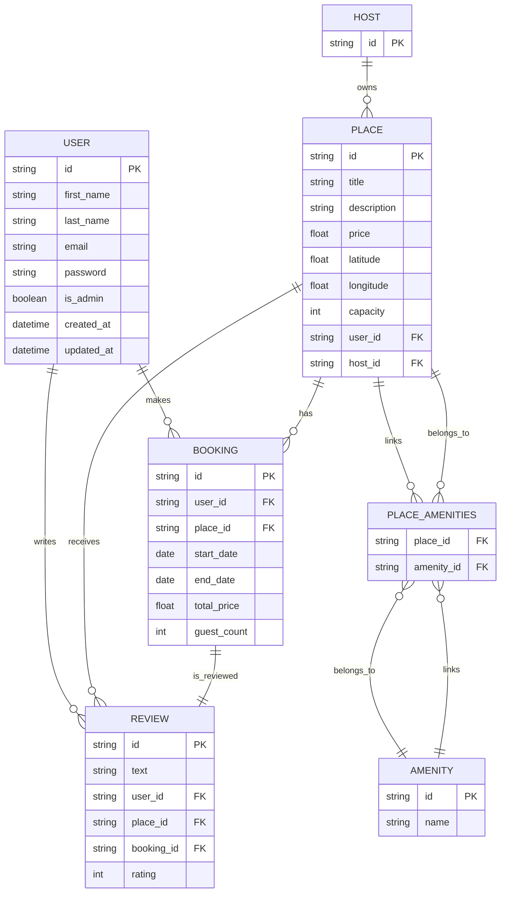

# HBnB (Holberton AirBnB Clone)

## Project Overview

HBnB is a clone of the AirBnB RESTful API, built with Flask, SQLAlchemy, and Flask-RESTX. It provides endpoints for managing users, hosts, places, amenities, bookings, and reviews.

## Features

* User registration & authentication with JWT
* Role-based access control (regular users, admins)
* CRUD operations for places, amenities, bookings, and reviews
* Database abstraction via SQLAlchemy & repository pattern
* Modular API structure with Flask-RESTX namespaces
* Configurable application factory

## Table of Contents

* [Project Overview](#project-overview)
* [Features](#features)
* [Getting Started](#getting-started)
  * [Prerequisites](#prerequisites)
  * [Installation](#installation)
  * [Database Initialization](#database-initialization)
  * [Running the Application](#running-the-application)
  * [Running Tests](#running-tests)
  * [Password Hashing Utility](#password-hashing-utility)
* [Data Model (ER Diagram)](#data-model-er-diagram)
* [Project Structure](#project-structure)
* [Contributing](#contributing)
* [License](#license)
* [Authors](#authors)

## Getting Started

### Prerequisites

* Python 3.10 or higher
* Git
* `virtualenv` (or Python’s built-in `venv` module)

### Installation

Clone the repository, set up a virtual environment, and install dependencies:

```bash
# Clone the repo
git clone https://github.com/Theo-D/holbertonschool-hbnb.git
cd holbertonschool-hbnb/part3/hbnb

# Create and activate a virtual environment
python3 -m venv venv

# Activate (macOS/Linux)
source venv/bin/activate

# Activate (Windows)
# venv\Scripts\activate

# Install Python dependencies
pip install -r requirements.txt
```

### Database Initialization

You have two options for creating the default admin user when initializing the database:

1. **Use Default Admin with Default Password:**
   - When you run the `flask init-db` command, the system will automatically check if an admin user exists. If no user exists, a default admin user will be created with the email `admin@hbnb.io` and the password `admin1234` (hashed).

   - **Command to initialize the database and create the default admin:**
     ```bash
     flask init-db
     ```

2. **Manually Create the Admin User via Flask Shell:**
   - If you want to manually create the admin user, you can use the Flask shell to create the user. This option allows you to customize the admin's email or password if needed.

   - **Steps to create the admin user manually:**
     1. Run the following command to enter the Flask shell:
        ```bash
        flask shell
        ```
     2. In the shell, run the following Python code to create the admin user:
        ```python
        from werkzeug.security import generate_password_hash
        from app import db
        from app.models import User

        # Create the admin user
        admin_user = User(
            first_name="Admin",
            last_name="User",
            email="admin@hbnb.io",
            is_admin=True
        )

        # Hash the password
        admin_user.password = generate_password_hash("admin1234")

        # Add and commit to the database
        db.session.add(admin_user)
        db.session.commit()

        print("Admin user created!")
        ```
     3. After running the above code, the admin user will be created with the email `admin@hbnb.io` and the hashed password `admin1234`.

### Running the Application

Start the development server:

```bash
python run.py
```

The API will be available at `http://localhost:5000/api/v1/` by default.

### Running Tests

Run the test suite using pytest:

```bash
pytest --maxfail=1 --disable-warnings -q
```

### Password Hashing Utility

A helper script `make_hash.py` is provided to both generate password hashes and verify passwords against existing hashes.

#### Hashing a Password

To generate a hash for a plaintext password, run:

```bash
python3 make_hash.py mySecretPass
```

This will output the original input and the generated hash, for example:

```
Original password: mySecretPass
Hashed password: pbkdf2:sha256:260000$...
```

#### Verifying a Password Against an Existing Hash

The script supports verifying a plaintext password against a provided hash. Use the `--hash` (or `-H`) flag:

```bash
python3 make_hash.py mySecretPass   --hash pbkdf2:sha256:260000$abcdef...
```

Or with the short flag:

```bash
python3 make_hash.py mySecretPass -H pbkdf2:sha256:260000$abcdef...
```

Depending on the match, it will print either:

```
✅ Password matches hash
```

or

```
❌ Password does NOT match hash
```


## Data Model (ER Diagram)

<details>
<summary>Click to expand ER Diagram (Mermaid)</summary>



</details>

## Project Structure

```bash
hbnb/                # Application package
├── app/             # Core application modules
│   ├── api/         # RESTX namespaces
│   ├── models/      # SQLAlchemy models
│   ├── services/    # Business logic (facade)
│   ├── persistence/ # Repository implementations
│   ├── database.py  # DB initialization
│   └── __init__.py  # Application factory
├── config.py        # Configuration classes & mapping
├── run.py           # Entry point to start the server
├── requirements.txt # Project dependencies
└── tests/           # Test suite
```

## Contributing

Contributions are welcome! Feel free to open issues or submit pull requests.

## License

This project is licensed under the [MIT License](LICENSE).

## Authors

- [DESSAIGNE Théo](https://github.com/Theo-D)
- [TRAN Jérôme](https://github.com/jerome244)
