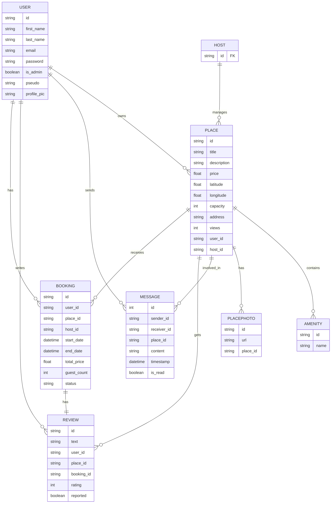
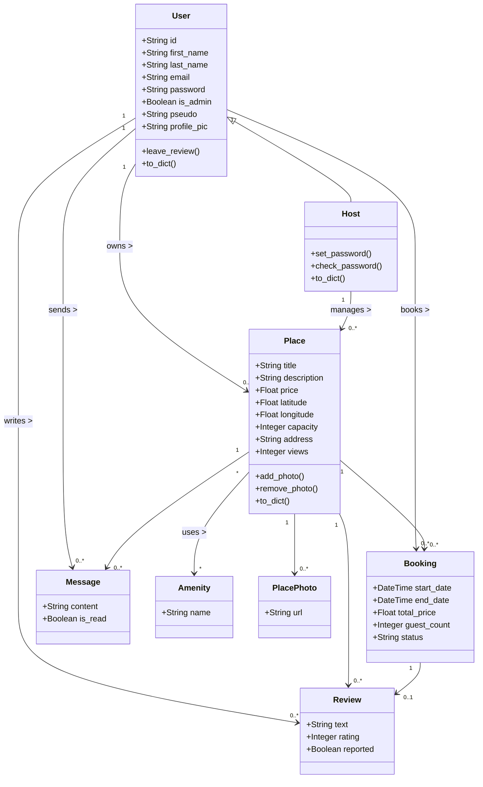

# 🏡 HBnB - Simple Web Client (Part 4)

This is the front-end implementation of the HBnB project (Part 4). It connects to the API and provides a user-friendly interface for booking, reviewing, and managing places.

---

## 🛠 Setup & Installation

### 1. **Clone the Repository**
Clone the repository to your local machine:
```bash
git clone https://github.com/jerome244/holbertonschool-hbnb.git
```

### 2. **Set up the Backend and Frontend**
Navigate to the `part4` directory and follow the installation steps:
```bash
cd holbertonschool-hbnb/part4
python3 -m venv venv
source venv/bin/activate
pip install -r requirements.txt
```

### 3. **Set Environment Variables**
```bash
export FLASK_APP=run.py
export FLASK_ENV=development
```

### 4. **(option 1) Run the Application**

After setting up your environment you have 2 options, first is to run the app with the already built-in database by running :

```bash
flask run
```

If you meet an "no such table: places" error try to run then :

```bash
flask db upgrade
```
and re-run :

```bash
flask run
```

### 5. **(option 2) Recreate the Database (Fresh Start)**
If you want to reset and start with a clean database:

```bash
rm -f instance/development.db
rm -rf migrations
flask db init
flask db migrate -m "initial"
flask db upgrade
flask init-db
```
This process will:
- Recreate the SQLite database
- Apply your latest schema

### 6. **Login**

After all of that try to login with the default admin user:
  - **Email**: `admin@hbnb.io`
  - **Password**: `admin1234`

Your app will be available at [http://127.0.0.1:5000](http://127.0.0.1:5000)

---

## 🚀 Features

1. **Login (JWT Authentication)**
   - Login to the application with JWT-based authentication.
   - The token is stored in a cookie to manage user sessions.

2. **List of Places**
   - The homepage displays a list of places available for booking.
   - Filters are available to view the places by price and location.
   - The four Newest and Top-Rated places sections

3. **Place Details**
   - Clicking on a place provides detailed information about that place including reviews and amenities.

4. **Add Reviews**
   - Authenticated users can add reviews to places they have visited.

5. **Notifications**
   - Notifications can be marked as read and interact with booking statuses.

6. **Admin: Add Amenities**
   - Admin users can manage amenities available for places.

7. **Reset DB Command**
   - Use `flask init-db` to reset the database and recreate the default admin.

---

## 🚧 Things Not Fully Implemented

- **Notifications:**
   - The notification feature currently do not work.

- **Future Features:**
   - Ideas for improving features like **Follow/Unfollow Functions**, **Report System**, **Block Users**, **Choice of Main Place Photo**, **Option for Changing the Language**, or either a **Dark Mode**.

---

## 🚨 Security Recommendations

1. **CORS Configuration:**
   - For development, CORS is enabled, but you should **restrict origins** in production for better security.

```python
CORS(app, origins=["https://yourdomain.com"])
```

---

## 🧑‍💼 Testing Instructions

1. **For Testing Reviews:**
   - You must first **book** a place for a review to be submitted.
   - The booking must be accepted by the host to enable the review submission.
   - Once the booking is confirmed, go to your **Dashboard** and navigate to **My Bookings** to access your bookings.

2. **For Admin Access:**
   - Log in as an admin (`admin@hbnb.io`, password `admin1234`).
   - To manage amenities go to the **Admin Manage Amenities** section in the green `admin` header tab.
   - Admins can view all users, add amenities, and grant admin access to other users.

---

## 🧠 Critique on Project Structure

- **Modularization Needed:**
   - It would be better to modularize the code, breaking down the large components into smaller, reusable components. This would improve the maintainability of the project.

- **Clean Up Uploaded Photos Folder:**
   - Currently, there is no system to clean up the uploaded images in the `uploads/` folder, especially after places or user data are deleted. 
   - Implementing a function to periodically remove unused or orphaned image files would help in keeping the folder clean and manageable.

---

## 📊 Diagrams

### 🗃 Entity-Relationship Diagram



### 🧱 Class Diagram



### 📦 Package Diagram

```mermaid
graph TD
  Part4 --> App
  Part4 --> Instance
  Part4 --> Migrations
  Part4 --> Diagram

  App --> Models
  App --> Routes
  App --> Services
  App --> Static
  App --> Templates
  App --> Utils
  App --> Persistence
  App --> API

  Static --> CSS
  Static --> JS
  Static --> Images
  Static --> Uploads

  API --> V1
  ```


### 🔁 Sequence Diagram - Booking

```mermaid
sequenceDiagram
  participant User
  participant AuthAPI
  participant BookingAPI
  participant DB
  participant ReviewAPI

  User->>AuthAPI: POST /login
  AuthAPI->>DB: Validate credentials
  DB-->>AuthAPI: OK
  AuthAPI-->>User: Auth token

  User->>BookingAPI: POST /bookings (token)
  BookingAPI->>DB: Create Booking
  DB-->>BookingAPI: Booking ID
  BookingAPI-->>User: Booking Confirmed

  User->>ReviewAPI: POST /reviews (text, rating, booking_id)
  ReviewAPI->>DB: Save Review
  DB-->>ReviewAPI: Review Saved
  ReviewAPI-->>User: Thank You!
```

---

## 📸 Screenshots

Here are some screenshots of the application in action:


### Dashboard Page


### Admin: All Users List


### Index Page


### Place Details Page


---

## 📄 License

This project is part of Holberton School curriculum and is available for educational purposes only.

---

## 👩‍💼 Author

**Jerome TRAN**  
GitHub: [jerome244](https://github.com/jerome244)
