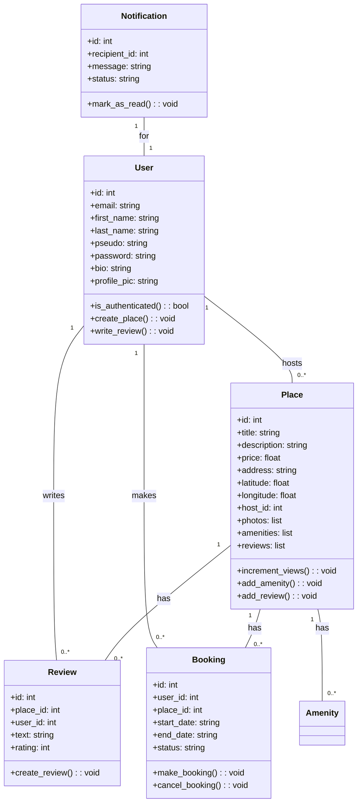
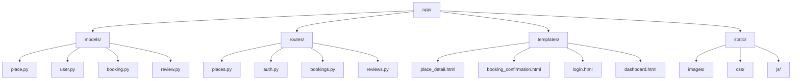
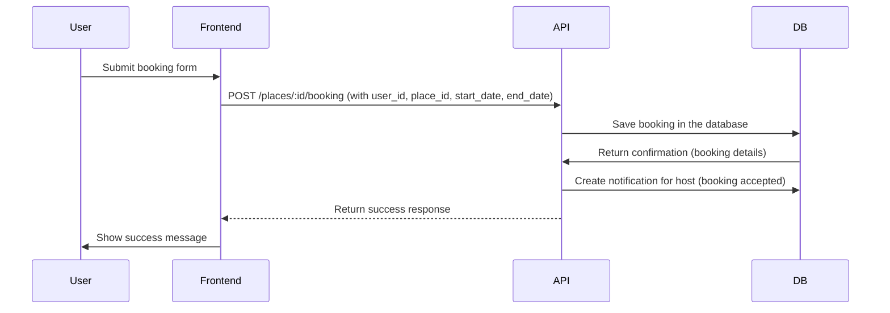

# 🏡 HBnB - Simple Web Client (Part 4)

This is the front-end implementation of the HBnB project (Part 4). It connects to the API and provides a user-friendly interface for booking, reviewing, and managing places.

---

## 🛠 Setup & Installation

### 1. **Clone the Repository**
   - Clone the repository to your local machine:
     ```bash
     git clone https://github.com/jerome244/holbertonschool-hbnb.git
     ```

### 2. **Set up the Backend and Frontend**

   - Navigate to the `part4` directory and follow the installation steps:

   ```bash
   cd part4
   python3 -m venv venv
   source venv/bin/activate
   pip install -r requirements.txt
   ```

### 3. **Set Environment Variables**
   ```bash
   export FLASK_APP=run.py
   export FLASK_ENV=development
   ```

### 4. **Initialize the Database**
   ```bash
   flask db init
   flask db migrate
   flask db upgrade
   ```

### 5. **Run the Application**
   ```bash
   flask run
   ```

### 6. **Reset DB (For Testing Purposes)**
   ```bash
   flask db downgrade
   flask db upgrade
   ```

---

## 🚀 Features

1. **Login (JWT Authentication)**
   - Login to the application with JWT-based authentication.
   - The token is stored in a cookie to manage user sessions.

2. **List of Places**
   - The homepage displays a list of places available for booking.
   - Filters are available to view the places by price and location.

3. **Place Details**
   - Clicking on a place provides detailed information about that place including reviews and amenities.

4. **Add Reviews**
   - Authenticated users can add reviews to places they have visited.

5. **Notifications**
   - Notifications can be marked as read and interact with booking statuses.

6. **Admin: Add Amenities**
   - Admin users can manage amenities available for places.

7. **Reset DB Command**
   - You can reset the database with `flask db downgrade` and `flask db upgrade`.

---

## 🚧 **Things Not Fully Implemented**

- **Notifications and Views Counter:**
   - The notification feature and views counter currently do not work and are pending development.

- **Future Features:**
   - Implement features like **Follow Functions**, **Report System**, and **Block Users**.
   - These features are planned for future updates.

---

## 🚨 **Security Recommendations**

1. **CORS Configuration:**
   - For development, CORS is enabled, but you should **restrict origins** in production for better security.
   ```python
   CORS(app, origins=["https://yourdomain.com"])
   ```

---

## 🧑‍💼 **Testing Instructions**

1. **For Testing Reviews:**
   - You must first **book** a place for a review to be submitted.
   - The booking must be accepted by the host to enable the review submission.
   - Once the booking is confirmed, go to your **Dashboard** and navigate to **My Bookings** to access your bookings.

2. **For Admin Access:**
   - Log in as an admin (`admin@hbnb.io`, password `admin1234`).
   - To manage amenities go to the **Admin Manage Amenities** section in `admin` green header tab.
   - Admins can view all users, add amenities and grant admin access to other users.

---

## 🛠 **Critique on Project Structure**

- **Modularization Needed:**
   - It would be better to modularize the code, breaking down the large components into smaller, reusable components. This would improve the maintainability of the project.

- **View Counter and Notification System:**
   - The view counter and notification system would need additional work for full functionality.

- **Clean Up Uploaded Photos Folder:**
   - Currently, there is no system to clean up the uploaded images in the `uploads/` folder, especially after places or user data are deleted. 
   - Implementing a function to periodically remove unused or orphaned image files would help in keeping the folder clean and manageable.

---

## 📊 **Diagrams**

### 🗃 Entity-Relationship Diagram


### 🧱 Class Diagram



### 📦 Package Diagram



### 🔁 Sequence Diagram - Booking


---

## 📸 Screenshots

Here are some screenshots of the application in action:

### Dashboard Page


### Admin: All Users List


### Index Page


### Place Details Page


---

## 📄 License

This project is part of Holberton School curriculum and is available for educational purposes only.

---

## 👩‍💼 **Author**

**Jerome TRAN**  
GitHub: [jerome244](https://github.com/jerome244)
